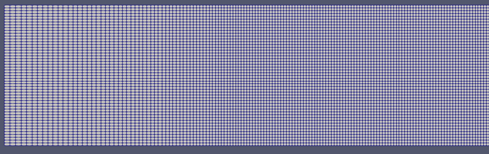

Mouvement du batteur
---------------------

**Description de la situation**

On se propose ici de simuler le mouvement d'un batteur piston, de façon 
similaire à la génération de houle par le batteur du canal à houle.

Pour reproduire le mouvement d'un batteur, nous utiliserons les fonctionnalités
de maillage dynamique d'OpenFOAM.

L'ensemble des opérations à effectuer se trouve dans le fichier ``Allrun.case``:

.. code-block:: bash

    #!/bin/bash

    . ${WM_PROJECT_DIR:?}/bin/tools/RunFunctions  #Charger les scripts OpenFOAM

    # Lancer le maillage
    Allmesh

    # Lancer le calcul. L'option -s lance setFields
    Allrun -s &

    # Attendre 2 secondes avant de lancer le monitoring
    sleep 2

    # Suivre la progression du calcul et lancer la commande
    # ls lorsque le calcul est terminé
    AllpostProcess lireSondes.py resample.py spectre.py

**Maillage**

Pour la géométrie de la simulation, nous utiliserons un canal rectangulaire,
qui se génère aisément à partir de l'outil ``blockMesh``. Le fichier de configuration
se trouve dans ``system/blockMeshDict``.

.. code-block::

    //Dimensions du canal
    xmin  0.0;
    xmax  26.0;
    xsep  4.0; //zone de séparation pour le premier bloc
    ymin  0.0;
    ymax  1.0;
    zmin  0.0;
    zmax  2.5;

    xLen #calc "$xmax - $xmin";
    zLen #calc "$zmax - $zmin";

    //Nombre de points dans la direction z (verticale)
    nz 50.0; //Doit être un double!

    //Taux de croissance du pas dx
    xgrad 0.5;

    //Nombre de points dans le direction x du maillage constant
    nx #calc "($xmax - $xsep)/($zmax - $zmin) * $nz";

    //Pas de discrétisation dans la direction x
    dx #calc "($xmax - $xsep) / $nx";

    //Nombre de points dans la partie non constante
    nxGauche #calc "log( $xgrad ) / log( ($xsep - $dx / $xgrad) / ($xsep - $dx) ) + 1.0";

    //Ne pas oublier de reconvertir en int
    Ng #calc "std::floor($nxGauche)";
    Nz #calc "std::floor($nz)";
    Nx #calc "std::floor($nx)";

    vertices
    (
    ($xmin  $ymin  $zmin) //0
    ($xsep  $ymin  $zmin) //1
    ($xsep  $ymin  $zmax) //2
    ($xmin  $ymin  $zmax) //3

    ($xmin  $ymax  $zmin) //4
    ($xsep  $ymax  $zmin) //5
    ($xsep  $ymax  $zmax) //6
    ($xmin  $ymax  $zmax) //7

    ($xmax  $ymin  $zmin) //8
    ($xmax  $ymin  $zmax) //9
    ($xmax  $ymax  $zmax) //10
    ($xmax  $ymax  $zmin) //11
    );

    blocks
    (
        hex (0 1 5  4 3 2 6  7)   ( $Ng 1 $Nz) simpleGrading ($xgrad 1 1)
        hex (1 8 11 5 2 9 10 6)   ( $Nx 1 $Nz) simpleGrading (  1    1 1)
    );

    edges
    (
    );

    boundary
    (
        bottom1
        {
            type wall;
            faces
            (
                (0 1 5 4)
            );
        }
        bottom2
        {
            type wall;
            faces
            (
                (1 8 11 5)
            );
        }
        front
        {
            type empty;
            faces
            (
                (0 1 2 3)
                (1 8 9 2)
            );
        }
        back
        {
            type empty;
            faces
            (
                (4 5 6 7)
                (5 11 10 6)
            );
        }
        leftwall
        {
            type patch;
            faces
            (
                (0 4 7 3)
            );
        }
        rightwall
        {
            type patch;
            faces
            (
                (8 11 10 9)
            );
        }
        top
        {
            type wall;
            faces
            (
                (3 2 6 7)
                (2 9 10 6)
            );
        }
    );

Le maillage sera découpé en deux parties: une première partie où le maillage ne sera pas
uniforme, pour absorber les déformations du maillage dynamique, et une autre partie
où le maillage sera uniforme.

La gestion du maillage s'effectue avec les lignes suivantes, issues de ``system/blockMeshDict``

.. code-block::

    blocks
    (
        hex (0 1 5  4 3 2 6  7)   ( $Ng 1 $Nz) simpleGrading ($xgrad 1 1)
        hex (1 8 11 5 2 9 10 6)   ( $Nx 1 $Nz) simpleGrading (  1    1 1)
    );

Le premier block s'étend de :math:`x=0` m à :math:`x=4` m où  le de croissance de
la dimension :math:`x` est de :math:`0.5`, qui s'indique avec la variable ``($xgrad 1 1)``. 
Le deuxième block s'étend de :math:`x=4` m à :math:`x=30` m et est uniforme, car nos taux 
de croissance sont tous à ``(1 1 1)``.

Après avoir lancé la commande ``blockMesh``, vous pouvez visualiser le maillage avec ``ParaView``.
Une capture d'écran est donnée ci-dessous.

**Génération de houle**

Le mouvement du batteur va être généré à partir du fichier de commande 
``mouvementBatteur.dat``:

.. code-block::

    (
    (0.0 (0.0 0 0))
    (0.0050000310568651205 (2.1000000000000002e-05 0 0))
    (0.010000062113730241 (4.29e-05 0 0))
    ...
    (804.9749999689432 (-1.91e-05 0 0))
    (804.98 (-2.51e-12 0 0))
    );

Chaque ligne du fichier est du type ``(t (x y z))``, où ``t`` correspond au
temps, et ``(x y z)`` sont les coordonnées du déplacement du batteur.
Le mouvement du batteur est horizontal, donc toutes les coordonnéees
``y`` et ``z`` sont nulles. 

Pour indiquer à OpenFOAM que l'on souhaite utiliser le maillage dynamique,
nous allons spéficier quelques paramètres dans le fichier ``constant/dynamicMeshDict``

.. code-block::

    dynamicFvMesh       dynamicMotionSolverFvMesh;
    motionSolverLibs    (fvMotionSolvers);

    solver              displacementLaplacian;

    displacementLaplacianCoeffs
    {
        diffusivity     inverseDistance (leftwall);
    }

La première ligne indique le type de maillage dynamique souhaité. Ici,
nous choisissons ``dynamicMotionSolverFvMesh`` qui est à utiliser
pour des mouvements de maillage. Il en existe plusieurs, 
comme ``dynamicRefineFvMesh``, qui permet de raffiner le maillage automatiquement
selon plusieurs critères. Pour plus d'informations sur les types de maillages
dynamiques, consultez la `documentation <https://www.openfoam.com/documentation/guides/latest/api/classFoam_1_1dynamicFvMesh.html>`_.

La deuxième ligne permet d'inclure la librairie de maillage dynamique. La
troisième ligne indique le type de solveur à utiliser pour la propagation
du déplacement du maillage. Le maillage sera comprimé/dilaté, et ce déplacement
va être propagé dans le reste du maillage. Cette propagation est résolue
avec différents solveurs. La `documentation <https://www.openfoam.com/documentation/guides/latest/doc/openfoam-guide-mesh-motion.html>`_
d'OpenFOAM sur les maillages dynamiques étant très incomplète, vous pourrez
voir le détail des solveurs disponibles en allant dans les 
`fichiers source <https://www.openfoam.com/documentation/guides/latest/api/fvMotionSolver_8H.html>`_
directement. 
`

La dernière partie donne des précisions sur la zone du maillage à déplacer,
en l'occurence le patch ``leftwall`` qui correspond à notre batteur.
Les autres paramètres indiquent la méthode de calcul de diffusivité, 
c'est-à-dire la propagation du déplacement de la zone mobile dans le 
reste du maillage. La méthode que nous utilisons ici est ``inverseDistance``,
mais vous pouvez aussi utiliser les modèles suivants:

.. code-block::

    (directional exponential file inverseDistance inverseFaceDistance 
    inversePointDistance inverseVolume motionDirectional quadratic 
    uniform)

Pour indiquer au batteur le mouvement qu'il doit effectuer, nous allons
configurer le fichier ``0.orig/pointDisplacement``:

.. code-block::

    dimensions      [0 1 0 0 0 0 0];

    internalField   uniform (0 0 0);

    boundaryField
    {

        leftwall
        {
            type            uniformFixedValue;
            uniformValue    tableFile;
            file            "mouvementBatteur.dat";
            outOfBounds     clamp;
        }

        "(back|front)"
        {
            type            empty;
        }

        rightwall
        {
            type            fixedValue;
            value           uniform (0 0 0);
        }

        "(bottom1|bottom2|top)"
        {
            type            zeroGradient;
        }
    }

Ce fichier permet d'indiquer le comportement de chaque limite du maillage.
En premier, nous indiquons à la limite ``leftwall`` de suivre les 
mouvements donnés dans ``mouvementBatteur.dat`` en spécifiant une condition
limite du type ``uniformFixedValue`` et ``tableFile``. 

La face verticale droite doît être fixe, ce que l'on précise bien avec la 
condition ``fixedValue``. Enfin, on ajoute une condition ``zeroGradient``
sur les limites hautes et basses, qui indique qu'on autorise le déplacement

Enfin, il faut ajouter une condition de ``movingWallVelocity`` dans le fichier
``0.orig/U`` pour indiquer à OpenFOAM que l'on est en présence d'un corps 
en déplacement, et qu'il faut prendre en compte le mouvement relatif de
cet objet.

.. code-block::

    leftwall
    {
        type            movingWallVelocity;
        value           uniform (0 0 0);
    }

Les autres conditions limites sont celles utilisées classiquement, avec 
absorption de la houle sur la face de sortie.

**Sondes et mesure de hauteur de houle**

Des sondes sont configurées dans le fichier ``system/controlDict``. 
Si vous souhaitez changer leur position/nom, éditez directement les 
variables définies à cet effet (``sonde1/x1``, etc).

.. code-block::

    // Indiquer ici les sondes et leurs coordonnées (position x en m)
    sonde1      S1-5.0;
    x1          5.0;
    sonde2      S2-10.0;
    x2          10.0;
    sonde3      S3-17.0;
    x3          17.0;
    sonde4      S4-24.0;
    x4          24.0;
    sonde5      inlet;
    x5          0.0;

    // Coordonnées des points de mesure
    ystart      0.0;
    yend        0.0;
    zstart      0.0;
    zend        2.0;
    N           201; // Nombre de points

    functions
    {

        line
        {
            type            sets;
            libs            ("libsampling.so");
            enabled         true; // Mettre à false pour désactiver les sondes

            // Contrôle d'écriture :
            //  - timeStep   : pas de temps
            //  - adjustable : temps (si pas de temps adaptatif)
            //  - runTime    : temps (si pas de temps constant)
            writeControl     timeStep;
            writeInterval    2;

            fixedLocations false;
            interpolationScheme cellPoint;
            setFormat       raw;
            sets
            (
                $sonde1
                {
                    type uniform;
                    axis distance;
                    start   ( $x1 $ystart $zstart );
                    end     ( $x1 $yend   $zend   );
                    nPoints $N;
                }
                $sonde2
                {
                    type uniform;
                    axis distance;
                    start   ( $x2 $ystart $zstart );
                    end     ( $x2 $yend   $zend   );
                    nPoints $N;
                }
                $sonde3
                {
                    type uniform;
                    axis distance;
                    start   ( $x3 $ystart $zstart );
                    end     ( $x3 $yend   $zend   );
                    nPoints $N;
                }
                $sonde4
                {
                    type uniform;
                    axis distance;
                    start   ( $x4 $ystart $zstart );
                    end     ( $x4 $yend   $zend   );
                    nPoints $N;
                }
                $sonde5
                {
                    type uniform;
                    axis distance;
                    start   ( $x5 $ystart $zstart );
                    end     ( $x5 $yend   $zend   );
                    nPoints $N;
                }
            );
            fields (
                alpha.water
            );
        }
    }

**solveur**

Pour lancer le calcul, copiez le dossier ``0.orig``, lancez ``setFields`` pour
initialiser la hauteur d'eau à 1.38 m et lancez le calcul avec la commande
``interFoam``. Vous pouvez aussi directement effectuer ces trois opérations avec
la commande ``Allrun -s &``. 

Le calcul est lancé avec un ``maxCo`` de 0.5, sur 20 secondes, 
en sauvegardant les données toutes les 0.1 secondes. Libre à 
vous de modifier la durée de la simulation ainsi que la durée de sauvegarde.

**Post-traitement**

Pour effectuer le traitement des mesures de sondes, vous pouvez lancer 
la commande:

.. code-block:: bash

    $ AllpostProcess lireSondes.py resample.py spectre.py

La commande ``AllpostProcess`` vous permet de lancer une série de scripts
lorsque la simulation sera terminée. Ici, nous lancerons d'abord le programme
de lecture de mesures de sondes pour extraire le signal de houle avec ``lireSondes.py``,
puis le programme de rééchantillonnage de ce signal avec ``resample.py``
car nos mesures ne sont pas effectuées à un pas de temps régulier. Enfin,
``spectre.py`` va reconstruire le spectre du signal de chaque sonde, 
en les comparant au spectre de JONSWAP théorique utilisé pour générer
le signal du batteur. Les paramètres du spectre théorique sont donnés dans
le fichier ``jonswapDict``.

Les signaux de houle sont disponibles dans les fichiers ``line_probes.csv``
et ``RESAMPLED_line_probes.csv`` (ce dernier étant le signal rééchantillonné).
