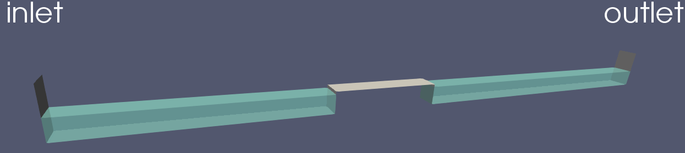

Mesure de pression sur un ouvrage
==================================

Ce tutoriel est destiné à la mesure de pression en un ou plusieurs
points.

**Description de la situation**

On se place dans la même géométrie que pour le tutoriel de 
:doc:`houle irrégulière<houleIrreguliere>`. A cette géométrie,
nous allons ajouter un obstacle rectangulaire, comme affiché sur la figure suivante.

Vous pouvez directement exécuter les scripts ``Allrun.case.turbulent`` ou 
``Allrun.case.laminaire``, qui comprennent la suite de commandes à exécuter
pour lancer la simulation:

.. code-block::
    
    #!/bin/bash

    # Lancer le maillage
    Allmesh -c

    # Générer l'obstacle
    runApplication topoSet
    runApplication subsetMesh c0 -patch obstacle -overwrite

    # Générer la houle irrégulière
    genHouleIrreguliere

    # Charger le fichier de turbulence
    cp constant/turbulenceProperties.turbulent constant/turbulenceProperties

    # Lancer le calcul. L'option -s lance setFields
    Allrun -s &

    # Attendre 5 secondes avant de lancer le monitoring
    sleep 5

    # Suivre la progression du calcul et lancer la commande
    # de lecture de sondes lorsque le calcul est terminé
    AllpostProcess lireSondes.py lirePoints.py

    traceSondes.py point1.csv
    traceSondes.py line_probes.csv

**Maillage**

Le maillage est le même que pour le tutoriel de :doc:`houle irrégulière<houleIrreguliere>`. La 
seule différence est l'ajout d'une condition limite vide dans le fichier ``system/blockMeshDict``

.. code-block:: none

    obstacle
    {
        type wall;
        faces ();
    }

C'est le patch qui va contenir les face de l'obstacle. Lancez ``blockMesh`` avec la commande::

    $ blockMesh

Pour définir les contours de l'obstacle, nous allons utiliser l'outil ``topoSet``, 
selon les paramètres indiqués dans ``system/topoSetDict``

.. code-block:: none

    actions
    (
        {
            name    c0;
            type    cellSet;
            action  new;
            source  boxToCell;
            sourceInfo
            {
                box (10 -99 -99) (15 99 1); // Edit box bounds as required
            }
        }

        {
            name c0;
            type cellSet;
            action invert;
        }
    );

On y trouve deux sections:

* La première section permet de définir les contours du rectangle qui fera office
  d'obstacle. Pour cela, on va créer un objet ``cellSet``, que l'on nomme ``c0``.
  Le mot-clé ``boxToCell`` nous permet de sélectionner une "boîte" dont les coordonnées
  sont donnés dans le sous-dictionnaire ``sourceInfo``. Il ne faut indiquer que 2 points
  pour générer une boîte. Dans notre cas, notre boîte est de dimensions ``(5x198x100)``.
  Notez que certaines coordonnées sont très grandes ou très petites. En théorie, notre boîte
  n'est que de dimensions ``(5x1x1)``. Si l'on avait mis les coordonnées exactes avec les limites 
  exactes de notre canal rectangulaire, il arrive parfois que l'outil ne sélectionne pas certains
  éléments du maillage à cause des erreurs de précision machine. Ainsi, si l'on veut sélectionner
  toute la largeur du canal par exemple, il est préférable d'indiquer des limites aberrantes 
  telles que ``(-99,99)`` plutôt que les coordonnées exactes ``(-0.5,0.5)``.

* La deuxième section vient inverser la sélection des mailles sélectionnées par notre boîte, et remplace
  cette nouvelle sélection. 

Lancez l'outil topoSet avec la commande::

    $ topoSet

Maintenant, nous avons ajouté une zone de type ``cellSet`` nommée ``c0``, mais il ne s'est encore rien 
passé sur le maillage. Pour "découper" le maillage généré avec ``blockMesh``, nous allons
utiliser l'outil ``subsetMesh``, avec la commande::

    $ subsetMesh c0 -patch obstacle -overwrite

* La première option à indiquer est la zone ``cellSet`` à découper dans le maillage.
* L'option ``-patch <patch>`` permet d'ajouter les nouvelles faces crées à une condition
  limite. Dans notre cas, nous avons créé un rectangle, dont les faces sont des 
  nouvelles conditions limites. Le patch ``obstacle`` contient maintenant les faces
  de la boîte créée.
* L'option ``-overwrite`` permet d'écrire le nouveau maillage par dessus le précédent.

Vous pouvez visualiser votre nouveau maillage sur ``ParaView``.

**Génération de houle**

La condition de houle est la même que pour le tutoriel de :doc:`houle irrégulière<houleIrreguliere>`.

**Lancement de la simulation**

Si vous le souhaitez, vous pouvez utiliser un modèle de turbulence. Pour cela,
utilisez le script ``Allrun.case.turbulent`` ou lancez la commande:

.. code-block:: bash

    mv constant/turbulenceProperties.komega constant/turbulenceProperties

En faisant cela, vous allez utiliser le modèle de turbulence :math:`k-\omega` SST.

N'oubliez pas de copier le fichier ``0.orig`` vers un nouveau dossier ``0`` et de
lancer ``setFields``, pour initialiser une hauteur d'eau de :math:`0.864\,m`:

.. code-block:: bash

    cp -r 0.orig 0
    setFields

En plus des sondes, nous avons rajouté un point de mesure de pression :

.. code-block:: none

    points
    {
        type            sets;
        libs            ("libsampling.so");
        enabled         true; // Mettre à false pour désactiver les sondes

        // Contrôle d'écriture :
        //  - timeStep   : pas de temps
        //  - adjustable : temps (si pas de temps adaptatif)
        //  - runTime    : temps (si pas de temps constant)
        writeControl     timeStep;
        writeInterval    2;
        fixedLocations false;
        interpolationScheme cellPoint;
        setFormat       raw;
        sets
        (
            point1
            {
                type cloud;
                axis distance;
                points
                (
                    (10 0 1)
                );
            }
        );
        fields
        (
            p
        );
    }

Pour donner un point de mesure dans OpenFOAM, il faut d'abord donner un ``set`` de mesures,
puis des sous-dictionnaires avec notre nuage de points de type ``cloud``. Par exemple, le nom 
du set ci-dessus est ``points``, et le nom du nuage de points est ``point1``. Ainsi,
si l'on veut spécifier plusieurs points, il y a deux façons de le faire: en ajoutant un 
set avec un autre ``cloud`` (par exemple, ``point2``), ou alors ajouter un autre point
dans la liste des points du ``cloud`` de ``point1``. Dans le premier cas, les 
résultats pour ``points1`` et ``points2`` seront écrits dans deux fichiers différents. 
Dans le deuxième cas, les points seront écrits dans les même fichiers, ce qui facilite le
traitement des données. 

.. NOTE::

    Vous pouvez aussi rajouter un nouveau sous-dictionnaire sur le modèle du set ``points``. Dans
    ce cas, les données seront écrites dans des dossiers différents.

**Post-traitement**

Un fois que la simulation est lancée, vous pouvez la surveiller avec le 
script ``AllpostProcess``. En options, vous pouvez y ajouter des scripts
que vous voulez exécuter. Dans notre cas, nous allons exécuter le fichier
de lecture des mesures de pression avec ``lirePoints.py``, ainsi 
que le fichier de lecture de mesures de sondes ``lireSondes.py``. Puis nous afficherons 
les deux signaux générés

.. code-block:: bash

    AllpostProcess lireSondes.py lirePoints.py
    traceSondes.py point1.csv
    traceSondes.py line_probes.csv
